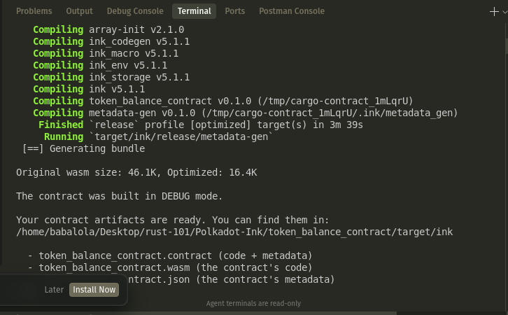

# Token Balance Contract

A simple smart contract that works like a basic bank, keeping track of token balances for different accounts.



## What it does

This contract allows you to:
- **Mint tokens** - Create new tokens (only the contract owner can do this)
- **Check balance** - See how many tokens an account has
- **Transfer tokens** - Send tokens from one account to another
- **Handle errors** - Prevents impossible operations like spending more than you have

## How it works

- Uses `Mapping<AccountId, u128>` to store balances (like a phone book: person → amount of money)
- Only the contract owner can mint new tokens
- Anyone can check balances and transfer their own tokens
- Includes proper error handling and events for important operations

## Contract Messages

### `mint(to: AccountId, amount: u128)`
- Creates new tokens and gives them to the specified account
- Only the contract owner can call this
- Emits `TokensMinted` event

### `balance_of(account: AccountId) -> u128`
- Returns the token balance of the specified account
- Anyone can call this

### `transfer(to: AccountId, amount: u128)`
- Transfers tokens from the caller to another account
- Prevents transferring to yourself
- Checks for sufficient balance
- Emits `TokensTransferred` event

### `my_balance() -> u128`
- Returns the caller's own token balance
- Convenience method

### `total_supply() -> u128`
- Returns the total number of tokens that exist

### `owner() -> AccountId`
- Returns the account that owns the contract

## Error Handling

The contract includes proper error handling for:
- `InsufficientBalance` - Trying to transfer more tokens than you have
- `TransferToSelf` - Trying to transfer tokens to yourself
- `NotOwner` - Trying to mint tokens when you're not the owner
- `InvalidAmount` - Trying to mint or transfer zero tokens

## Events

- `TokensMinted` - Emitted when new tokens are created
- `TokensTransferred` - Emitted when tokens are moved between accounts

## Building the Contract

```bash
cargo contract build
```

## Testing

The contract includes unit tests that verify:
- Basic functionality works
- Error handling works correctly
- Only the owner can mint tokens
- Transfers work properly
- Insufficient balance is handled

Run tests with:
```bash
cargo test
```
